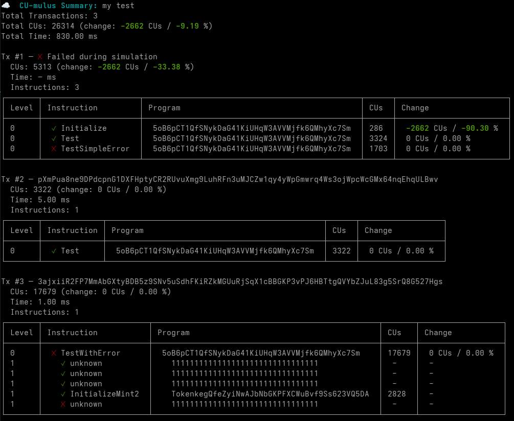

<p align="center">
  
</p>

# CU-mulus

CU-mulus is a lightweight and easy-to-set-up TypeScript benchmarking library that helps developers measure and analyze the performance of their Solana programs.

## Features
- 🚀 Benchmark any Solana transaction
- 📈 Collect per-instruction metrics (CUs, nested CPI calls, success/failure)
- 🧩 Compare current vs. previous benchmark results (absolute & relative change)
- 💾 Save benchmark results to a file
- 🎨 Color-coded terminal output for quick performance insights

-----------



## Installation

### Using npm
```console
npm install @ikrk/cu-mulus
```

### Using yarn
```console
yarn add @ikrk/cu-mulus
```

## Usage

```typescript
import * as anchor from "@coral-xyz/anchor";
import { ExampleProgram } from "../target/types/example_program";
import { bench, getCumulus, initCumulus } from "@ikrk/cu-mulus";

describe("anchor-bencher", () => {
  anchor.setProvider(anchor.AnchorProvider.env());
  let connection = anchor.getProvider().connection;

  // ✅ Initialize CU-mulus
  initCumulus(connection);

  const program = anchor.workspace.exampleProgram as anchor.Program<ExampleProgram>;

  after(() => {
    // 💾 Save all benchmarks after the test suite completes
    getCumulus().saveToFile();
  });

  it("My test", async () => {
   // 🌯 Wrap one or multiple transactions with CU-mulus bench function
    await bench("My init ix bench", async () => {
      await program.methods.initialize().rpc();
    });
  });
});
```

## Configuration

The `bench` function allows users to pass an optional `BenchOptions` object to customize the behavior of the benchmarking.

```typescript
const defaultOpts: BenchOptions = {
  // --- Transaction Confirmation ---
  waitForTx: true, // Wait for transaction confirmation.
  getTxRetries: 10, // Max attempts to fetch transaction logs.
  getTxDelayMs: 200, // Delay (ms) between fetch attempts.

  // --- CU Increase Error Thresholds (Error if increase >= value; 0 disables check) ---

  // Total Benchmark CUs (Absolute / Relative %)
  errorOnBenchCUsAbsIncrease: 0,
  errorOnBenchCUsRelIncrease: 0,

  // Total Transaction CUs (Absolute / Relative %)
  errorOnTxCUsAbsIncrease: 0,
  errorOnTxCUsRelIncrease: 0,

  // Max Instruction CUs (Absolute / Relative %)
  errorOnIxCUsAbsIncrease: 0,
  errorOnIxCUsRelIncrease: 0,
};
```
